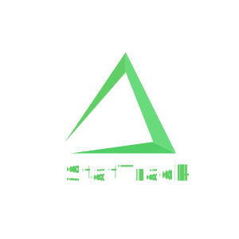

<!-- Improved compatibility of back to top link: See: https://github.com/othneildrew/Best-README-Template/pull/73 -->

<a name="readme-top"></a>

<!--
*** Thanks for checking out the Best-README-Template. If you have a suggestion
*** that would make this better, please fork the repo and create a pull request
*** or simply open an issue with the tag "enhancement".
*** Don't forget to give the project a star!
*** Thanks again! Now go create something AMAZING! :D
-->

<!-- PROJECT SHIELDS -->
<!--
*** I'm using markdown "reference style" links for readability.
*** Reference links are enclosed in brackets [ ] instead of parentheses ( ).
*** See the bottom of this document for the declaration of the reference variables
*** for contributors-url, forks-url, etc. This is an optional, concise syntax you may use.
*** https://www.markdownguide.org/basic-syntax/#reference-style-links
-->

[![Contributors][contributors-shield]][contributors-url]
[![Forks][forks-shield]][forks-url]
[![Stargazers][stars-shield]][stars-url]
[![Issues][issues-shield]][issues-url]
[![MIT License][license-shield]][license-url]

<!-- PROJECT LOGO -->
<br />
<div align="center">
  <a href="https://github.com/Bulk-bros/stattrack">
    
  </a>

  <h3 align="center">StatTrack</h3>

  <p align="center">
    Track your progress, view trends & get suggestions to help you reach your goals!
    <br />
    <a href="#"><strong>Getting started</strong></a>
    |
    <a href="https://github.com/Bulk-bros/stattrack/blob/main/README.md"><strong>Explore the docs</strong></a>
    <br />
    <br />
    <a href="#">View Demo</a>
    ·
    <a href="https://github.com/Bulk-bros/stattrack/issues">Report Bug</a>
    ·
    <a href="https://github.com/Bulk-bros/stattrack/issues">Request Feature</a>
  </p>
</div>

<!-- TABLE OF CONTENTS -->
<details>
  <summary>Table of Contents</summary>
  <ol>
    <li>
      <a href="#about-the-project">About The Project</a>
      <ul>
        <li><a href="#built-with">Built With</a></li>
      </ul>
    </li>
    <li>
      <a href="#getting-started">Getting Started</a>
      <ul>
        <li><a href="#prerequisites">Prerequisites</a></li>
        <li><a href="#installation">Installation</a></li>
      </ul>
    </li>
    <li><a href="#roadmap">Roadmap</a></li>
    <li><a href="#contributing">Contributing</a></li>
    <li><a href="#license">License</a></li>
    <li><a href="#contact">Contact</a></li>
    <li><a href="#acknowledgments">Acknowledgments</a></li>
  </ol>
</details>

<!-- ABOUT THE PROJECT -->

## About The Project

A fitness app with the main goal the help you reach your fitness goals. Track your meals, with detailed inforamtion about nutritions, get quick feedback on how you're doing, see your trends and get suggestions based on your routines.

<p align="right">(<a href="#readme-top">back to top</a>)</p>

### Built With

Frameworks / libraries used in this project:

- <a href="">Flutter</a>

<!-- For reference --

- [![Next][next.js]][next-url]
- [![React][react.js]][react-url]
- [![Vue][vue.js]][vue-url]
- [![Angular][angular.io]][angular-url]
- [![Svelte][svelte.dev]][svelte-url]
- [![Laravel][laravel.com]][laravel-url]
- [![Bootstrap][bootstrap.com]][bootstrap-url]
- [![JQuery][jquery.com]][jquery-url] -->

<p align="right">(<a href="#readme-top">back to top</a>)</p>

<!-- GETTING STARTED -->

## Getting Started

### Prerequisites

Make sure you have downloaded and installed flutter. Use flutter doctor to make sure everything is working:

```
flutter doctor
```

Fork / clone repo and cd into it

### Installation

1. Make sure you are in the right directory

2. Install all dependecies

```
flutter pub get
```

3. Run app

```
flutter run
```

4. You are done 👍🏿

<p align="right">(<a href="#readme-top">back to top</a>)</p>

<!-- ROADMAP -->

## Roadmap

See the [open issues](https://github.com/Bulk-bros/stattrack/issues) for a full list of proposed features (and known issues).

<p align="right">(<a href="#readme-top">back to top</a>)</p>

<!-- CONTRIBUTING -->

## Contributing

No contribution. This is a school project, we don't want your help😤

<p align="right">(<a href="#readme-top">back to top</a>)</p>

<!-- LICENSE -->

## License

Distributed under the MIT License. See `LICENSE.txt` for more information.

<p align="right">(<a href="#readme-top">back to top</a>)</p>

<!-- CONTACT -->

## Contact

By mail:

- <a href="mailto: falniir@gmail.com">Eduard</a>
- <a href="mailto: taurstein@gmail.com">Torstein</a>
- <a href="mailto: richileu.a.bailey@gmail.com">Richileu</a>
- <a href="mailto: joakimedvardsen2000@gmail.com">Joakim</a>

Project Link: [https://github.com/Bulk-bros/stattrack](https://github.com/Bulk-bros/stattrack)

<p align="right">(<a href="#readme-top">back to top</a>)</p>

<!-- ACKNOWLEDGMENTS -->

## Acknowledgments

Thanks to:

- [MIT license](https://github.com/Bulk-bros/stattrack/blob/main/LICENSE)
- [Shields IO](https://shields.io)
- [Font Awesome](https://fontawesome.com)
- [Figma](https://www.figma.com)
- [Readme Template](https://github.com/othneildrew/Best-README-Template)

<p align="right">(<a href="#readme-top">back to top</a>)</p>

<!-- MARKDOWN LINKS & IMAGES -->
<!-- https://www.markdownguide.org/basic-syntax/#reference-style-links -->

[contributors-shield]: https://img.shields.io/github/contributors/bulk-bros/stattrack?style=for-the-badge
[contributors-url]: https://github.com/Bulk-bros/stattrack/graphs/contributors
[forks-shield]: https://img.shields.io/github/forks/bulk-bros/stattrack?style=for-the-badge
[forks-url]: https://github.com/Bulk-bros/stattrack/network/members
[stars-shield]: https://img.shields.io/github/stars/bulk-bros/stattrack?style=for-the-badge
[stars-url]: https://github.com/Bulk-bros/stattrack/stargazers
[issues-shield]: https://img.shields.io/github/issues/bulk-bros/stattrack?style=for-the-badge
[issues-url]: https://github.com/Bulk-bros/stattrack/issues
[license-shield]: https://img.shields.io/github/license/bulk-bros/stattrack?style=for-the-badge
[license-url]: https://github.com/Bulk-bros/stattrack/blob/main/LICENSE
