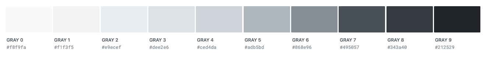
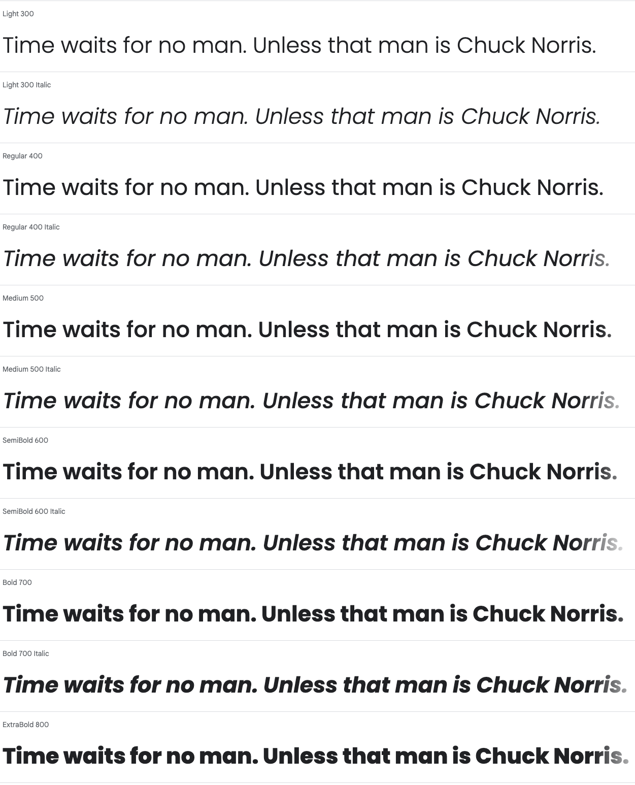

# Design Guidlines

## **Theme**

A combination of minimalist/simple and plain/neutral. The users experience should be the main focus and the design should emphasis users self defined goals in fitness. Follows a structural layout that is not confusing for the users.

### **Colors**

The main colors should be white for background and black (with a slight opacity) for foreground like text. To make the app pop a little more, green is used for accent elements

#### **Background and foreground colors**

#### **Accent colors**

### **Typography**

- Sans-serif with sharp edges for serious look.
- Both heading and body text should be sans-serif.
- Heading and text that is important should use a bolder version of the font to stand out.

#### **Font family - Poppins**

#### **Font sizes**

8px - 10px - 13px - 16px - 20px - 25px - 31px - 39px - 48px

_Heading text: 31px_  
_Body text: 16px_

### **Images**

Images for private use. Like profil picture and pictures for recipes to easily distinguish recipes from each other.

### **Icons**

Icons will be used for some parts of the page such as navigation.

Icons with as little details as possible should be used, and the icons should not be too round (they should fit the rest of the design, a plain / neutral feel).

### **Borders**

Little to none border rounding. Maximum a 5px border rounding on buttons and cards.

### **Shadows**

Use a tiny box shadow around cards and other elements that needs to stick out from the white background.

_Specific box shadow: x:0, y:5px, blur: 10px, color: #000, opacity: 10%_
