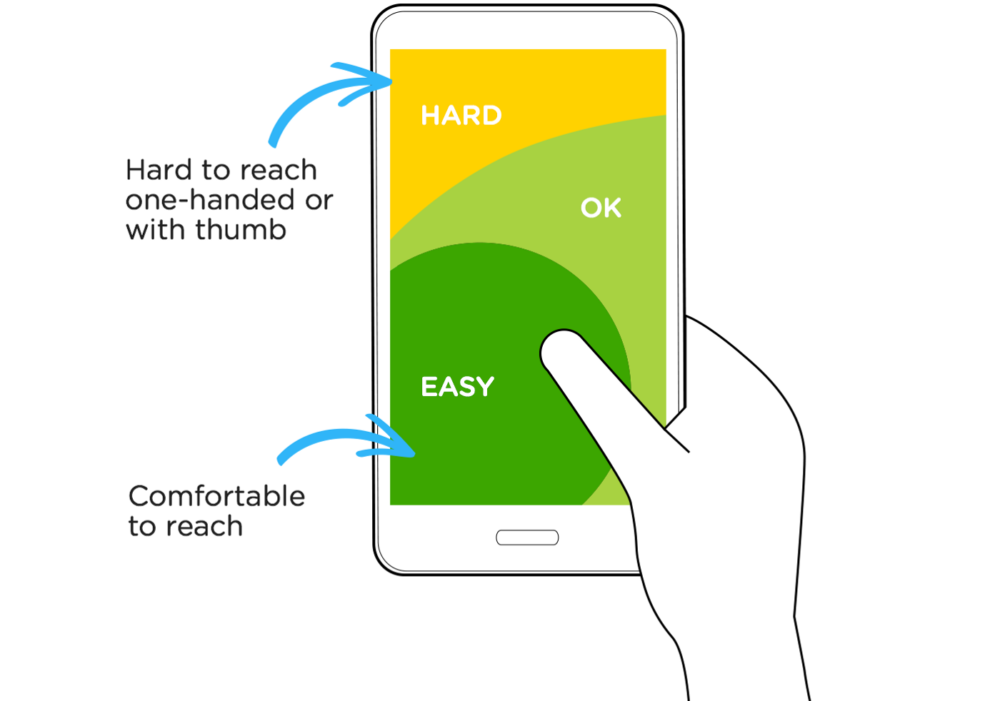

# General results

## Good

### Functionality

- Good that you can overwrite recommended macros
- Liked the drill down options

### Design

- Good layout, simple and clear
- Logically information distribution
- Intuitive navigation
- Nice color palett, healthy color
- Good contrasts, some grey color was a little bit hard to read

**Color blindness:** Have tested colors in a [colorblind simulator](https://www.color-blindness.com/coblis-color-blindness-simulator/), everthing looks fine

**Thumb reachability:** Have looked through the app and thought of thumb reachability for easy access. Everything looked fine, a few compromises in "not that important" places.

## Improvment

### Functionality

- Add birthday picker to signup
- Choose weight loss/gain in kg instead of percentage
- When creating meal, see current macros
- Replace height with goal (height is useless info)
- Click on weight redirects to see weight graph
- More specific weight with decimal
- Settings icon on profile page -> redirect to settins page
- Replace yearly with quartly or just add it
- Ability to scan barcode to add ingredient
- Unclear what "add instruction" when creating meal is for

### Design

- Ability to change color
- Have a homepage with some graphics (logo, background) when you first launch the app (not signed in)
- Clearer units in general
- Add editing icon to setup estimated page
- "Create new mean" button could be more clear
- Log page bigger font
- Not always intuitivt that the pluss icon always had the same functionallity

## To be considered

- Ability to add calories manually
- Animate charts on load
